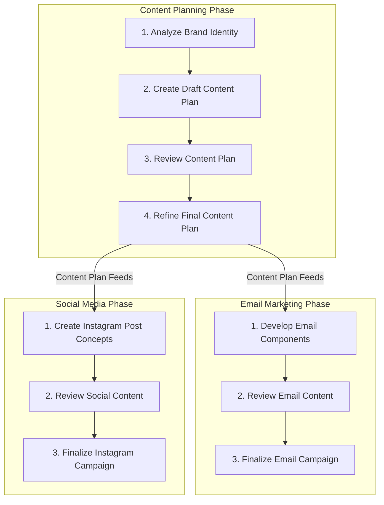

# Example Flow

## Mermaid Flow Diagram

### Code Flow 

```mermaid
graph TD
    subgraph "Content Planning Phase"
        A1[1. Analyze Brand Identity] --> A2[2. Create Draft Content Plan]
        A2 --> A3[3. Review Content Plan]
        A3 --> A4[4. Refine Final Content Plan]
    end
    
    subgraph "Email Marketing Phase"
        B1[1. Develop Email Components] --> B2[2. Review Email Content]
        B2 --> B3[3. Finalize Email Campaign]
    end
    
    subgraph "Social Media Phase"
        C1[1. Create Instagram Post Concepts] --> C2[2. Review Social Content]
        C2 --> C3[3. Finalize Instagram Campaign]
    end
    
    A4 -->|Content Plan Feeds| B1
    A4 -->|Content Plan Feeds| C1
```

### Diagram Visual 

